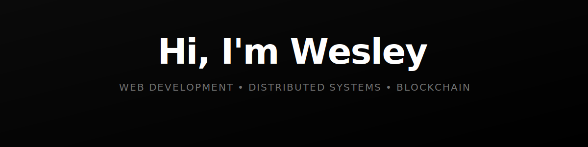

---

### 🛠️ Tech Stack

**Languages & Frameworks**

**Blockchain & Web3**

---

### 📊 GitHub Stats

<table>
<tr>
<td>
<picture>
<source media="(prefers-color-scheme: dark)" srcset="https://github-readme-stats-six-seven.vercel.app/api?username=wezzcoetzee&show_icons=true&count_private=true&hide_border=true&bg_color=00000000&title_color=ffffff&text_color=a1a1aa&icon_color=22c55e">
<source media="(prefers-color-scheme: light)" srcset="https://github-readme-stats-six-seven.vercel.app/api?username=wezzcoetzee&show_icons=true&count_private=true&hide_border=true&theme=default">

</picture>
</td>
<td>
<picture>
<source media="(prefers-color-scheme: dark)" srcset="https://github-readme-stats-six-seven.vercel.app/api/top-langs/?username=wezzcoetzee&layout=compact&langs_count=8&hide_border=true&bg_color=00000000&title_color=ffffff&text_color=a1a1aa">
<source media="(prefers-color-scheme: light)" srcset="https://github-readme-stats-six-seven.vercel.app/api/top-langs/?username=wezzcoetzee&layout=compact&langs_count=8&hide_border=true&theme=default">

</picture>
</td>
</tr>
</table>

---

*"Code is like humor. When you have to explain it, it's bad."* — Cory House

